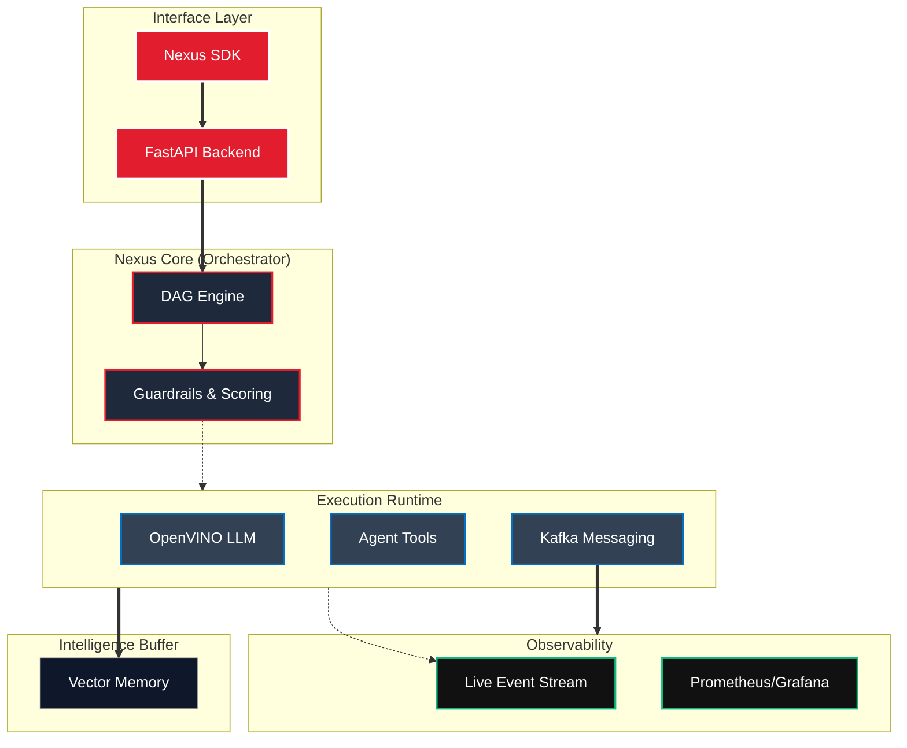

<p align="center">
  
</p>

<h1 align="center">Nexus Ray Framework</h1>

<p align="center">
  <strong>Enterprise-grade AI agent workflow orchestration with real Intel® OpenVINO™ LLM integration</strong>
</p>

<p align="center">
  
  
  
</p>

---

## 🧠 Overview

**Nexus Ray** is a **production-ready framework** for building autonomous, multi-agent AI systems.  
It combines **DAG-based workflow orchestration**, **optimized local LLM inference using Intel® OpenVINO™**, and an **event-driven architecture** to deliver scalable, observable, and enterprise-safe AI pipelines.

Designed for:
- Agentic AI systems
- Research & industry automation
- Local-first, privacy-preserving inference
- Production deployments

---

## ✨ Key Capabilities

### 🔹 Core Orchestration
- **DAG Workflows** – Parallel execution, retries, and fault tolerance  
- **Multi-Agent Coordination** – Collaboration, consensus, and role-based agents  
- **Guardrails** – Safety validation, scoring, and approval gates  

### 🔹 Advanced Intelligence
- **OpenVINO LLM Inference** – Optimized Mistral-7B (INT8 / FP16)  
- **Vector Memory** – Semantic context retention and recall  
- **Reference Agents** – Research, science, and industry pipelines  

### 🔹 Enterprise-Ready
- **Kafka Messaging** – Event-driven, decoupled execution  
- **Observability** – Metrics, traces, and live execution feed  
- **Production APIs** – FastAPI backend with Docker support  

---

## 🏗️ Architecture



---

## ⚡ Quick Start

Run a multi-agent system in under 2 minutes.

### 1️⃣ Backend Server
```bash
pip install -r requirements.txt
uvicorn src.api.server:app --reload
```

### 2️⃣ Frontend Dashboard
```bash
cd frontend
npm install
npm run dev
```

🌐 Open [http://localhost:5173](http://localhost:5173) to access the **Live Graph Dashboard**:
- **Real-time workflow graph** visualization
- **Agent execution & token metrics** tracking
- **Human-in-the-Loop (HITL) approvals** for critical steps

---

## 📦 What’s Included

### 🧩 Framework Components
- **SDK & Graph Engine** – Build workflows with `WorkflowBuilder`
- **Agent Runtime** – LLM, tool, and agent executors
- **LLM Server** – High-performance local inference engine

### 📊 Monitoring & UX
- **Web Dashboard** – Real-time visualization
- **TUI Dashboard** – Terminal-based monitoring
- **Observability Layer** – Logs, metrics, and traces

---

## 🚀 Intel® OpenVINO™ Benchmarks

Nexus Ray includes first-class benchmarking for OpenVINO-optimized LLMs.

### ⚡ Pre-Optimization vs Post-Optimization

| Stage | Precision | Throughput | Latency | RAM Usage |
| :--- | :---: | :---: | :---: | :---: |
| Pre-Optimization | FP16 | ~1.2 tok/s | ~42s | 16.5 GB |
| **Post-Optimization** | **INT8** | **~2.28 tok/s** | **~22s** | **~8.9 GB** |
| **Improvement** | — | 🚀 **~2× Faster** | ⚡ **~50% Lower** | 💾 **~47% Less** |

> [!TIP]
> OpenVINO INT8 quantization enables high-quality inference on 16GB RAM systems while delivering nearly 2× performance gains.

### 🧪 Run Benchmarks
```bash
# 1️⃣ Verify & download models (Prerequisite)
python scripts/verify_downloads.py
python scripts/download_models.py

# 2️⃣ Run the benchmark suite
python scripts/benchmark_models.py

# 3️⃣ View results
cat benchmark_results.json
```

### 🛠️ Utility Scripts
Nexus Ray includes a suite of specialized tools for developers and researchers:
- **`check_hallucinations.py`** – Automated validation of LLM outputs against ground truth.
- **`stress_test_industrial.py`** – High-load simulation for industrial agent workflows.
- **`recover_from_cache.py`** – Manage and repair local model/result caches.
- **`verify_downloads.py`** – Integrity checks for OpenVINO model artifacts.

### 🔍 Troubleshooting
- Use **`scripts/debug_imports.py`** to resolve environment/dependency issues.
- Use **`scripts/debug_hf.py`** to diagnose Hugging Face model loading errors.

---

## 📚 Documentation
<h3 align="center"> 
  <a href="docs/quickstart_benchmarking.md">Benchmarking Guide</a> ⭐ **NEW** | 
  <a href="docs/benchmarking.md">Intel OpenVINO Optimization</a> ⭐ **NEW** |
  <a href="docs/dag_flows.md">DAG Workflows</a> ⭐ **NEW**
</h3>

---

## 🛡️ License
Released under the MIT License. Built for research, industry, and production AI systems.

---

## 👥 The Team

Meet the minds behind Nexus Ray:

| Avatar | Name | Role | GitHub |
| :---: | :--- | :--- | :--- |
|  |  **Rishikesh Koli** | Project Lead & Architect | [@rishikoli](https://github.com/rishikoli) |
|  | **Yashraj Kulkarni** | Core Framework Developer | [@Yashraj045](https://github.com/Yashraj045) |
|  | **Anagha Bhure** | QA & Optimization | [@svpcet0303](https://github.com/svpcet0303) |

---
<p align="center"> <strong>Nexus Ray — Architecting the future of autonomous agentic AI</strong> </p>
