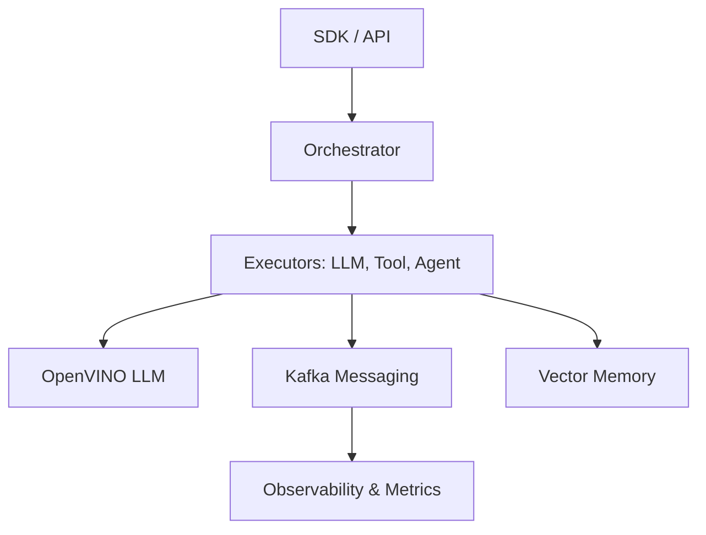

# Nexus Ray Framework

[]() []() []()

**Enterprise-grade AI agent workflow orchestration with real OpenVINO LLM integration.**

Nexus Ray is a production-ready framework for building autonomous multi-agent systems. It combines DAG-based workflows, optimized local LLM inference, and event-driven architecture to create robust, scalable AI solutions.

---

## 🚀 Key Features

| Core Capabilities | Advanced Intelligence | Enterprise Ready |
|-------------------|----------------------|------------------|
| **DAG Workflows**<br>Parallel execution & retries | **OpenVINO Inference**<br>Optimized Mistral-7B | **Kafka Messaging**<br>Event-driven architecture |
| **Multi-Agent**<br>Consensus & collaboration | **Vector Memory**<br>Semantic context retention | **Observability**<br>Metrics, traces & live feed |
| **Guardrails**<br>Safety validation & scoring | **Reference Agents**<br>Science & Industry pipelines | **Production APIs**<br>FastAPI & Docker support |

## 🏗️ Architecture



## ⚡ Quick Start

Get a multi-agent system running in under 2 minutes:

```bash
# 1. Install
git clone https://github.com/your-org/nexus-ray.git
cd nexus-ray
pip install -r requirements.txt

# 2. Configure (Optional: Set specific LLM path)
export NEXUS_RAY_LLM__MODEL_PATH=models/mistral-7b-ov

# 3. Run Demo
python examples/demo_llm_working.py
```

## 📦 What's Included

*   **SDK & Graph Engine**: Build complex workflows with `WorkflowBuilder`.
*   **LLM Server**: High-performance local inference server.
*   **Agent Library**: Pre-built agents for logic, negotiation, and research.
*   **Dashboard**: TUI and Web dashboards for real-time monitoring.

## 📚 Documentation

*   [**API Reference**](docs/api_reference.md)
*   [**Deployment Guide**](docs/deployment_guide.md)
*   [**Architecture Deep Dive**](docs/architecture.md)

---
*Built with ❤️ by the Nexus Ray team*
