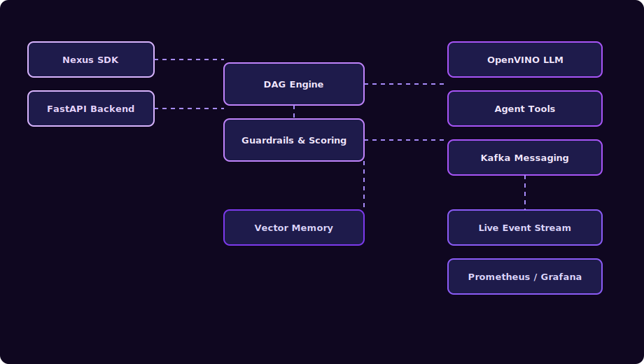

<h1 align="center">Nexus Ray Framework</h1>

<p align="center">
  <strong>Enterprise-grade AI agent workflow orchestration with real Intel® OpenVINO™ LLM integration</strong>
</p>

<p align="center">
  
  
  
</p>

---

## Overview

**Nexus Ray** is a **production-ready framework** for building autonomous, multi-agent AI systems.  
It combines **DAG-based workflow orchestration**, **optimized local LLM inference using Intel® OpenVINO™**, and an **event-driven architecture** to deliver scalable, observable, and enterprise-safe AI pipelines.

**Designed for:**
*   Agentic AI systems
*   Research & industry automation
*   Local-first, privacy-preserving inference
*   Production deployments

---

## Technical Stack

<p align="left">
  
  
  
  
  
  
</p>

---

## Key Capabilities

### Core Orchestration
*   **DAG Workflows**: Parallel execution, retries, and fault tolerance.
*   **Multi-Agent Coordination**: Collaboration, consensus, and role-based agents.
*   **Guardrails**: Safety validation, scoring, and approval gates.

### Advanced Intelligence
*   **OpenVINO LLM Inference**: Optimized Mistral-7B (INT8 / FP16).
*   **Vector Memory**: Semantic context retention and recall.
*   **Reference Agents**: Research, science, and industry pipelines (7-agent workflows).

### Enterprise Readiness
*   **Kafka Messaging**: Event-driven, decoupled execution.
*   **Observability**: Metrics, traces, and live execution feed.
*   **Production APIs**: FastAPI backend with Docker support.

---

## Architecture



---

## Quick Start

Run a multi-agent system in under 2 minutes.

### 1. Backend Server
```bash
pip install -r requirements.txt
uvicorn src.api.server:app --reload
```

### 2. Frontend Dashboard
```bash
cd frontend
npm install
npm run dev
```

**Access the Live Graph Dashboard at [http://localhost:5173](http://localhost:5173):**
*   **Real-time workflow graph** visualization
*   **Agent execution & token metrics** tracking
*   **Human-in-the-Loop (HITL) approvals** for critical steps

---

## System Components

### Framework
*   **SDK & Graph Engine**: Build workflows with `WorkflowBuilder`
*   **Agent Runtime**: LLM, tool, and agent executors
*   **LLM Server**: High-performance local inference engine

### Monitoring & UX
*   **Web Dashboard**: Real-time visualization
*   **TUI Dashboard**: Terminal-based monitoring
*   **Observability Layer**: Logs, metrics, and traces

---

## Intel® OpenVINO™ Benchmarks

Nexus Ray includes first-class benchmarking for OpenVINO-optimized LLMs.

### Pre-Optimization vs Post-Optimization

Throughput (tok/s)
FP16  | ███████░░░░░░░░ 1.2
INT8  | ██████████████░ 2.28   🚀 ~2×

Latency (seconds)
FP16  | ████████████████ 42s
INT8  | ████████░░░░░░░ 22s    ⚡ ~50%↓

Memory (GB)
FP16  | ████████████████ 16.5
INT8  | ████████░░░░░░░ 8.9    💾 ~47%↓

> [!TIP]
> OpenVINO INT8 quantization enables high-quality inference on 16GB RAM systems while delivering nearly 2× performance gains.

### Quick Run
```bash
# 1. Verify & download models (Prerequisite)
python scripts/verify_downloads.py
python scripts/download_models.py

# 2. Run the benchmark suite
python scripts/benchmark_models.py

# 3. View results
cat benchmark_results.json
```

### Utility Scripts
Nexus Ray includes a suite of specialized tools for developers and researchers:
*   **`check_hallucinations.py`**: Automated validation of LLM outputs against ground truth.
*   **`stress_test_industrial.py`**: High-load simulation for industrial agent workflows.
*   **`recover_from_cache.py`**: Manage and repair local model/result caches.
*   **`verify_downloads.py`**: Integrity checks for OpenVINO model artifacts.

### Troubleshooting
*   Use **`scripts/debug_imports.py`** to resolve environment/dependency issues.
*   Use **`scripts/debug_hf.py`** to diagnose Hugging Face model loading errors.

---

## Documentation
<h3 align="center"> 
  <a href="docs/quickstart_benchmarking.md">Benchmarking Guide</a> | 
  <a href="docs/dag_flows.md">DAG Workflows</a>
</h3>

### Formal Deliverables

| Document | Description |
| :--- | :--- |
| **[System Design](docs/DESIGN.md)** | Formal Architecture, Component Breakdown & Design Decisions |
| **[SDK API Reference](docs/SDK_API.md)** | `WorkflowBuilder` fluent API & Dev Guide |
| **[Reference Agents](docs/REFERENCE_AGENTS.md)** | Documentation for Protein-Drug Discovery & Fab Optimization Agents |
| **[Performance Report](docs/PERFORMANCE_REPORT.md)** | **Intel® OpenVINO™** Benchmarks (INT8 vs FP16) |

---

## License
Released under the MIT License. Built for research, industry, and production AI systems.

---

## The Team

Meet the minds behind Nexus Ray:

|       | Name | Role | GitHub |
| :---: | :--- | :--- | :--- |
|  |  **Rishikesh Koli** | Project Lead & Architect | [@rishikoli](https://github.com/rishikoli) |
|  | **Yashraj Kulkarni** | Core Framework Developer | [@Yashraj045](https://github.com/Yashraj045) |
|  | **Anagha Bhure** | QA & Optimization | [@svpcet0303](https://github.com/svpcet0303) |

---
