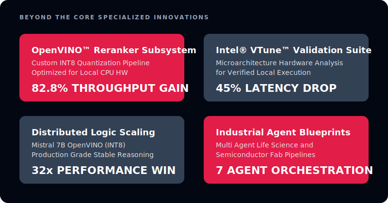
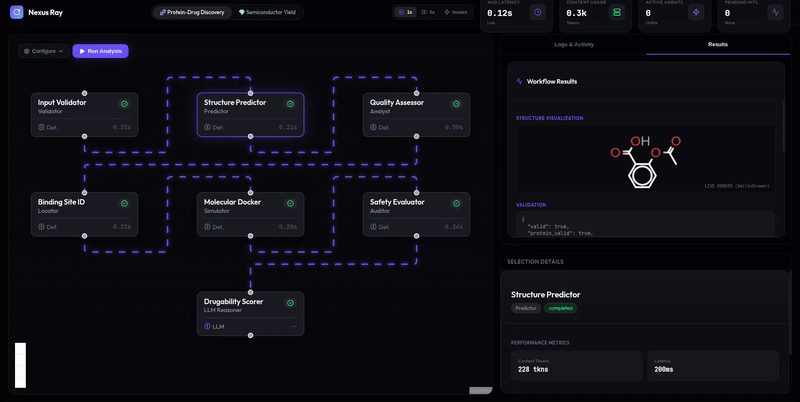

<h1 align="center">Nexus Ray Framework</h1>

<p align="center">
  <strong>Agentic AI agent workflow orchestration with real Intel® OpenVINO™ LLM integration</strong>
</p>

<p align="center">
  
  
  
  
  
  
  
  
</p>

<br>

## Overview

**Nexus Ray** is a **production-ready framework** for building autonomous, multi-agent AI systems.  
It combines **DAG-based workflow orchestration**, **optimized local LLM inference using Intel® OpenVINO™**, and an **event-driven architecture** to deliver scalable and observable AI pipelines.

**Designed for:**
*   Agentic AI systems
*   Research & industry automation
*   Local-first, privacy-preserving inference
*   Production deployments

<br>

## Beyond the Core Specialized Innovations

<div align="center">



</div>

<br>

## Technical Stack

<p align="left">
  
  
  
  
  
  
  
  
  
</p>

<br>

## Key Capabilities

### Core Orchestration
*   **DAG Workflows**: Parallel execution, retries, and fault tolerance.
*   **Multi-Agent Coordination**: Collaboration, consensus, and role-based agents.
*   **Guardrails**: Safety validation, scoring, and approval gates.

### Advanced Intelligence
*   **OpenVINO LLM Inference**: Optimized Mistral-7B (INT8 / FP16).
*   **Vector Memory**: Semantic context retention and recall.
*   **Reference Agents**: Research, science, and industry pipelines (7-agent workflows).

### Deployment Readiness
*   **Kafka Messaging**: Event-driven, decoupled execution.
*   **Observability**: Metrics, traces, and live execution feed.
*   **Production APIs**: FastAPI backend with Docker support.

<br>

## Architecture


<br>

## Workspace Demo



<br>

## Quick Start

Run a multi-agent system in under 2 minutes.

### 1. Backend Server
```bash
pip install -r requirements.txt
uvicorn src.api.server:app --reload
```

### 2. Frontend Dashboard
```bash
cd frontend
npm install
npm run dev
```

### 3. Containerized Deployment (Alternative)
For isolated production-like environments, use the provided Docker configuration:
```bash
# Build the backend image
docker build -t nexus-ray-backend .

# Run the container
docker run -p 8000:8000 nexus-ray-backend
```

**Access the Live Graph Dashboard at [http://localhost:5173](http://localhost:5173):**
*   **Real-time workflow graph** visualization
*   **Agent execution & token metrics** tracking
*   **Human-in-the-Loop (HITL) approvals** for critical steps

<br>

## System Components

### Framework
*   **SDK & Graph Engine**: Build workflows with `WorkflowBuilder`
*   **Agent Runtime**: LLM, tool, and agent executors
*   **LLM Server**: High-performance local inference engine

### Monitoring & UX
*   **Web Dashboard**: Real-time visualization
*   **Observability Layer**: Logs, metrics, and traces

<br>

## Intel® OpenVINO™ Benchmarks

Nexus Ray includes first-class benchmarking for OpenVINO-optimized LLMs.

### Performance Comparison



> [!TIP]
> OpenVINO INT8 quantization enables high-quality inference on 16GB RAM systems while delivering nearly 2× performance gains.

### Quick Run
```bash
# 1. Verify & download models (Prerequisite)
python scripts/verify_downloads.py
python scripts/download_models.py

# 2. Run the benchmark suite
python scripts/benchmark_models.py

# 3. View results
cat benchmark_results.json
```

### Utility Scripts
Nexus Ray includes a suite of specialized tools for developers and researchers:
*   **`check_hallucinations.py`**: Automated validation of LLM outputs against ground truth.
*   **`stress_test_industrial.py`**: High-load simulation for industrial agent workflows.
*   **`recover_from_cache.py`**: Manage and repair local model/result caches.
*   **`verify_downloads.py`**: Integrity checks for OpenVINO model artifacts.

### Troubleshooting
*   Use **`scripts/debug_imports.py`** to resolve environment/dependency issues.
*   Use **`scripts/debug_hf.py`** to diagnose Hugging Face model loading errors.

<br>

## Documentation

### Formal Deliverables
<div align="center">

<br>

> ### **[<u>System Design</u>](docs/DESIGN.md)**
> *Deep Dive into Framework Architecture, Multi-Agent Orchestration, and Core Design Decisions*

<br>

> ### **[<u>SDK API Reference</u>](docs/SDK_API.md)**
> *Comprehensive Guide to the `WorkflowBuilder` Fluent API and Programmatic Agent Coordination*

<br>

> ### **[<u>Reference Agents</u>](docs/REFERENCE_AGENTS.md)**
> *In-depth Documentation for 7-Agent Reference Pipelines in Life Sciences and Semiconductor Manufacturing*

<br>

> ### **[<u>Performance Report</u>](docs/PERFORMANCE_REPORT.md)**
> *Comparative Performance Analysis of Intel® OpenVINO™ Optimizations (INT8 vs. FP16 Baseline)*

<br>

</div>

<br>

<br>

## Intel® Technology Roadmap: The Path to Confidential AI

To ensure Nexus Ray remains at the forefront of secure, industrial-grade agent orchestration, our roadmap focuses on deep integration with the Intel® software and hardware ecosystem:

*   **Confidential Agent Coordination (Intel® SGX)**: Implementing **Intel® Software Guard Extensions** to create secure enclaves for agent execution. This ensures that sensitive medical data in Life Sciences and proprietary yield parameters in Semiconductor manufacturing remain encrypted even during active processing.
*   **Cross-Architecture Scaling (Intel® oneAPI)**: Leveraging the **Intel® oneAPI** abstraction layer to seamlessly scale Nexus Ray's multi-agent logic from Xeon® CPUs to Intel® Arc™ and Data Center GPUs without codebase modifications.
*   **Enterprise Swarm Orchestration (Intel® Tiber™ AI Cloud)**: Providing a native deployment path to **Intel® Tiber™ AI Cloud** for orchestrating massive-scale industrial agent swarms across global infrastructure.
*   **Sustainability & Green AI**: By optimizing for high-throughput execution on **Intel® CPUs + OpenVINO™**, Nexus Ray significantly reduces the carbon footprint and energy overhead compared to traditional GPU-reliant agent frameworks.

<br>

## License
Released under the MIT License. Built for research, industry, and production AI systems.

<br>

<h2 align="center">The Team</h2>

<div align="center">

Meet the minds behind Nexus Ray:

|       | Name | Role | GitHub |
| :---: | :--- | :--- | :--- |
|  |  **Rishikesh Koli** | Project Lead & Architect | [@rishikoli](https://github.com/rishikoli) |
|  | **Anagha Bhure** | QA & Optimization | [@svpcet0303](https://github.com/svpcet0303) |
|  | **Yashraj Kulkarni** | Core Framework Developer | [@Yashraj045](https://github.com/Yashraj045) |

</div>
