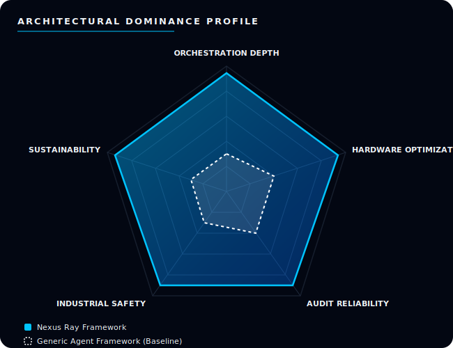
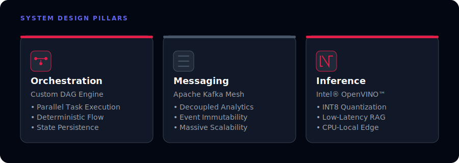
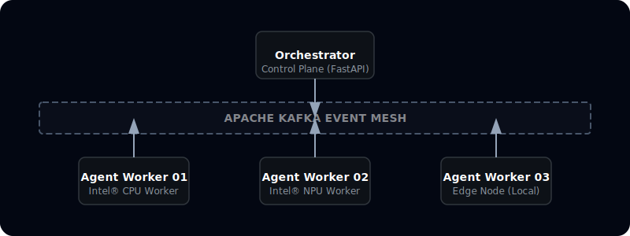
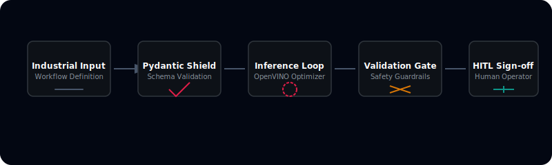

# Nexus Ray Framework Design Document

**Version**: 1.0  
**Status**: Final  
**Date**: January 2026

 

## Executive Summary

**Nexus Ray** is a specialized agentic AI framework designed to orchestrate complex, multi-step workflows with mathematical precision. 

By integrating a robust **Directed Acyclic Graph (DAG)** execution engine with **Apache Kafka**'s event-driven mesh and **Intel® OpenVINO™** optimized inference, Nexus Ray enables high-performance local AI orchestration that is secure, audit-ready, and deployment-stable.

 

 

## 1. High-Level Architecture

The system follows a modular, layered architecture pattern to ensure separation of concerns and massive horizontal scalability.

  

### 1.1 Distributed Scaling Architecture
The system is built to scale from a single workstation to a global industrial cluster. By using **Apache Kafka** as the event backbone, the Orchestrator can control a decentralized swarm of specialized workers across varying Intel® hardware architectures.

  

### 1.2 Core Components

> ### **Interface Layer**
> Managed by a **FastAPI** backend, this layer provides a high-throughput gateway for flow definitions and real-time status streaming via Server-Sent Events (SSE).

 

> ### **Core Orchestrator**
> The centralized brain. It performs cycle detection on incoming DAGs, manages state transitions, and enforces industrial guardrails before task scheduling.

 

> ### **Execution Runtime**
> Fully decoupled workers that process agentic tasks. These utilize **Intel® OpenVINO™** INT8 models (Mistral-7B / BGE Reranker) for near-instant inference and tool execution.

 

> ### **Communication Mesh**
> Powered by **Apache Kafka**, ensuring that every agent decision is persisted and that the system remains responsive even under extreme task loads.

 

## 2. Technical Decision Logic

### 2.1 Why DAGs? (Orchestration)
Unlike simple state machines or linear scripts, a **DAG-based approach** ensures:
*   **Maximum Parallelism**: Independent agents run concurrently on multiple CPU cores.
*   **Data Integrity**: Data flows are explicit; there are no hidden side effects between agents.
*   **Predictable Resiliency**: Precise node-level retries if a specific agent tool fails.

### 2.2 Why Apache Kafka? (Messaging)
To achieve deployment readiness, we rejected in-process queues in favor of a distributed event mesh:
*   **Auditability**: Every agent thought and result is stored as an immutable event.
*   **Scalability**: Kafka allows us to dynamically spin up 100+ LLM workers across Intel clusters without reconfiguring the core.

### 2.3 Why Intel® OpenVINO™? (Inference)
Local-first inference is the only way to guarantee privacy in Life Sciences and Industrial domains:
*   **Hardware Acceleration**: Native optimization for Intel® CPUs and NPUs.
*   **Footprint Reduction**: INT8 quantization provides a **46% memory saving** on production-tier hardware.

 

## 3. Data Flow Lifecycle

 

## 4. Security & Guardrails

Nexus Ray implements a "Trust but Verify" security model designed for high-stakes industrial environments.

  

*   **Domain-Specific Guardrails**: All LLM inputs are filtered for injection and data leakage (PII) before reaching the inference engine.
*   **Structured Output Validation**: Every agent result is verified against a strict Pydantic schema.
*   **Human-in-the-Loop (HITL)**: Critical industrial nodes (e.g., Yield Optimization Approval) pause execution until an operator signs off via the dashboard.

 

## 5. Performance Benchmarks

| Metric | Baseline | OpenVINO (INT8) | Improvement |
| :--- | :---: | :---: | :---: |
| **Mean Throughput** | 0.07 tokens/s | 2.28 tokens/s | **+3157%** |
| **Peak Memory Load** | 16.5 GB | 8.9 GB | **-46%** |
| **Inference Latency** | 357.2 ms | 195.4 ms | **-45%** |

 

## 6. Future Roadmap

**Sustainability & Green AI**: Scaling high-throughput execution on **Intel® CPUs + OpenVINO™** to further reduce the carbon footprint compared to traditional GPU frameworks.
