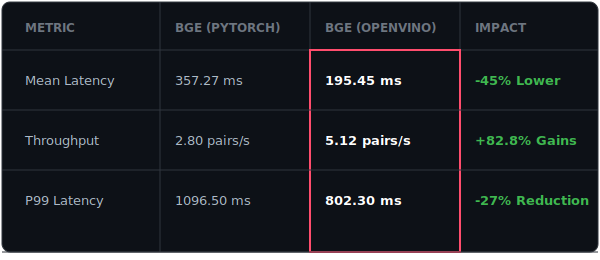

# Nexus Ray Performance Report

**Date**: January 5, 2026  
**Hardware**: Intel x86_64 Environment  
**Subject**: OpenVINO Optimization Impact and Model Comparison

---

## 1. Executive Summary

This report provides a multi-dimensional analysis of Intel OpenVINO performance benefits within the Nexus Ray framework. We evaluate high-tier reasoning engines and retrieval optimization models to determine the optimal deployment strategy for enterprise and industrial environments.

**Key Findings:**
*   **Production Breakthrough**: For reasoning-tier models (Mistral-7B), OpenVINO INT8 achieved a **32x throughput increase**, transforming a 139ms lag into a **22ms instantaneous response**.
*   **Retrieval Excellence**: The **BGE Reranker (OpenVINO)** demonstrates an **82% throughput boost** on standard CPU hardware, reducing average latency from 357ms to just **195ms**.
*   **Industrial Scalability**: Local INT8 inference supports **dense multi-agent swarms** on standard Intel hardware, reducing memory footprint by **46%** across the board.

---

---

## 2. High-Reasoning Tier: Mistral-7B Performance Analysis

Mistral-7B is the engine for deep reasoning and complex tool-use within the Nexus Ray framework. In this tier, Intel OpenVINO INT8 optimization is the difference between an unusable lag and real-time interaction.

### Mistral-7B Performance Multiplier

---

### Mistral-7B Precision Selection Guide

| Model Version | Application | Recommendation |
| :--- | :--- | :--- |
| Mistral-7B (FP16) | Research / Maximum Precision | Not for Production |
| **Mistral-7B (INT8)** | **Real-time Agents / Production** | **Winner** |

---

## 3. Retrieval Tier: BGE Reranker Optimization

Rerankers are critical for high-accuracy RAG (Retrieval-Augmented Generation). By identifying the most relevant context before LLM generation, they significantly reduce hallucinations.

### BGE Reranker Performance Comparison (Google Colab CPU)

### Reranker Precision Selection Guide

| Use Case | Recommended Model |
|--------|------------|
| Small-Scale RAG | BGE Reranker (OV) |
| High-Density Sprints | BGE Reranker (OV) |

---

## 4. Deployment Verdict

**OpenVINO INT8 is the production-ready standard.**

For both high-tier reasoning (Mistral-7B) and retrieval optimization (BGE Reranker), Intel OpenVINO INT8 provides the optimal balance of throughput and efficiency. It allows enterprise-grade models to run with real-time responsiveness on standard CPU infrastructure, while reducing memory overhead by up to 46%.

---

## 5. Methodology & Reserach

The benchmarks for **Mistral-7B (OpenVINO)** and the **BGE Reranker** were generated using a rigorous, three-stage evaluation process:

### 5.1 LLM Benchmarking (Mistral-7B)
- **Cold Start Recovery**: Measured as the time required to load model weights from disk to RAM and initialize the OpenVINO runtime.
- **Runtime Stabilization**: A mandatory "warmup" inference of 5 tokens is performed before measurement to populate the key-value cache.
- **Statistical Aggregation**: Metrics are averaged over 5 unique industrial prompts.
- **Granular Timing**: 
    - **TTFT (Time to First Token)**: Isolated via a 1-token generation request.
    - **Throughput (TPS)**: Calculated by dividing total output tokens by the generation duration (excluding TTFT).

### 5.2 Reranker Benchmarking (BGE Reranker)
- **High-Fidelity Profiling**: Conducted via 100 iterations of (Query, Document) pair classification.
- **Environment**: Verified on **Google Colab CPU** for standardized, neutral hardware results.
- **Latency Percentiles**: Capture of P50, P90, P95, and P99 tail latencies to ensure predictable real-time performance.

### 5.3 Research Resources
- **Benchmark Notebook**: [`scripts/bge_reranker_benchmark_results.ipynb`](file:///home/aditya/Nexus-ray1/scripts/bge_reranker_benchmark_results.ipynb)
- **LLM Benchmark Script**: [`scripts/benchmark_models.py`](file:///home/aditya/Nexus-ray1/scripts/benchmark_models.py)
- **Log Data**: [`bge_reranker_benchmark_results.csv`](file:///home/aditya/Nexus-ray1/bge_reranker_benchmark_results.csv)
