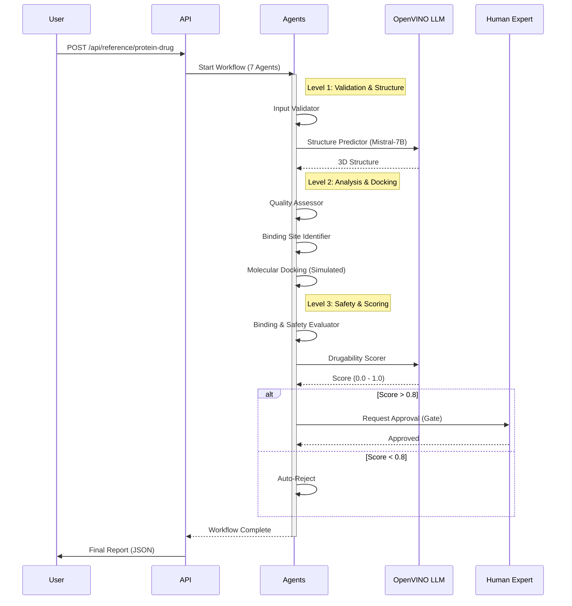
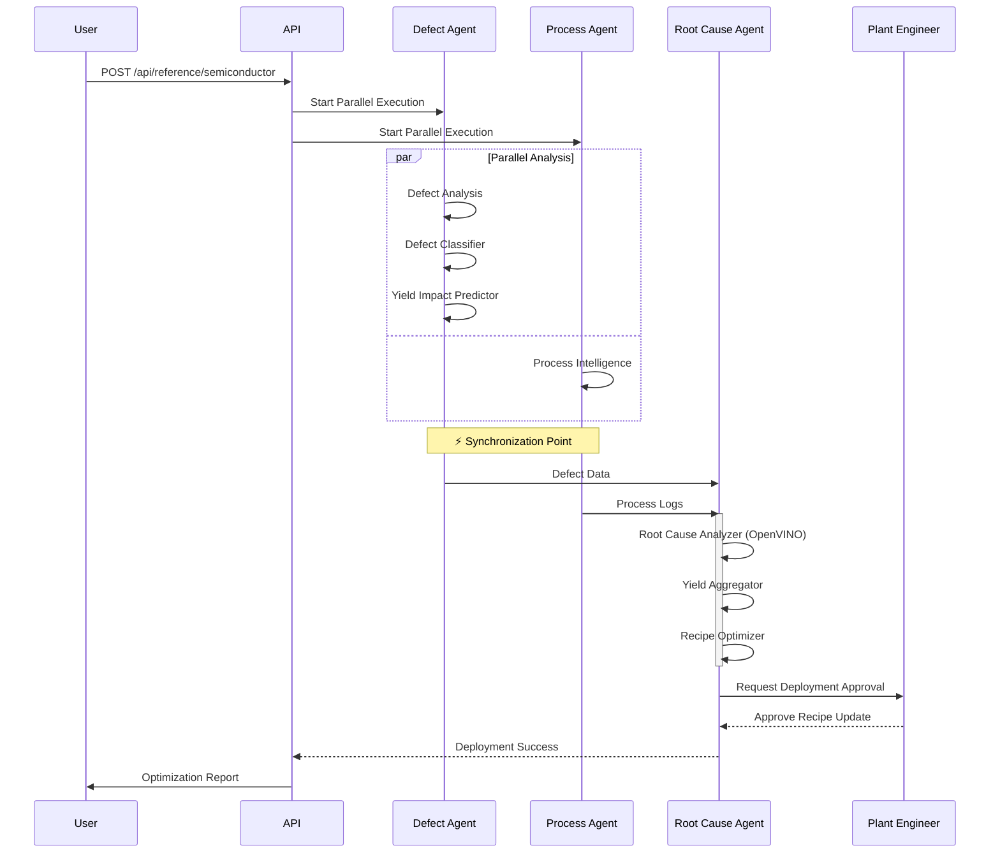

# Reference Agents & Workflows

**Nexus Ray** ships with two fully implemented reference agents that demonstrate the framework's capability to handle complex, domain-specific logic in **Life Sciences** and **Precision Manufacturing**.

These agents are not mock-ups; they are functional **7-agent workflows** that utilize the SDK, OpenVINO LLM inference, and the core orchestration engine.

---

## 1. Agent A: Protein-Drug Discovery Pipeline (7 Agents)

**Domain**: Computational Biology / Pharmaceutical Research  
**Goal**: Identify viable drug candidates by simulating molecule binding and safety checks before expensive lab trials.

### Workflow Visualization



### Step-by-Step Breakdown

1.  **Input Validator (Agent)**: Checks if the input FASTA sequence and small molecule SMILES string are valid formats.
2.  **Structure Predictor (Agent)**: Uses LLM reasoning to predict the 3D secondary structure (alpha-helices, beta-sheets) of the protein target.
3.  **Binding Site Identifier (Agent)**: Scans the predicted structure to find "pockets" where a drug molecule could theoretically attach.
4.  **Molecular Docking (Tool)**: A computationally intensive step (simulated) that calculates the binding affinity energy (ΔG).
5.  **Binding & Safety Evaluator (Agent)**: Analyzes the docking results to flag potential off-target effects or toxicity risks.
6.  **Drugability Scorer (LLM)**: An **OpenVINO-optimized Mistral-7B** model synthesizes all data to assign a final score (0.0 - 1.0).
7.  **Expert Review (HITL)**: If the score is high (>0.8), a human expert must approve the candidate before it moves to the "Clinical Trial" phase.

---

## 2. Agent B: Semiconductor Yield Optimization (7 Agents)

**Domain**: Industrial Automation / Smart Manufacturing  
**Goal**: Analyze wafer fabrication data to detect defects and autonomously recommend recipe adjustments to improve yield.

### Workflow Visualization



### Key Features Demonstrated

*   **Parallel Execution**: The "Defect Analysis" (Image data) and "Process Intelligence" (Sensor logs) paths run simultaneously to reduce total cycle time.
*   **Data Fusion**: The "Root Cause Analyzer" waits for *both* upstream branches to complete before correlating visual defects with sensor anomalies.
*   **Critical Safety**: The "Recipe Deployment" step is a live write-access tool. It is protected by a mandatory **Human-in-the-Loop** gate to prevent automated agents from potentially damaging fabrication equipment.
*   **OpenVINO Optimization**: The "Recipe Optimizer" uses a quantized LLM to process thousands of parameter permutations in seconds.

---

## 3. Running the Reference Agents

You can trigger these agents directly from the CLI or the Web Dashboard.

```bash
# Run Protein Discovery
python -m src.cli.run_workflow --name protein_drug_discovery

# Run Semiconductor Optimization
python -m src.cli.run_workflow --name semiconductor_yield
```
