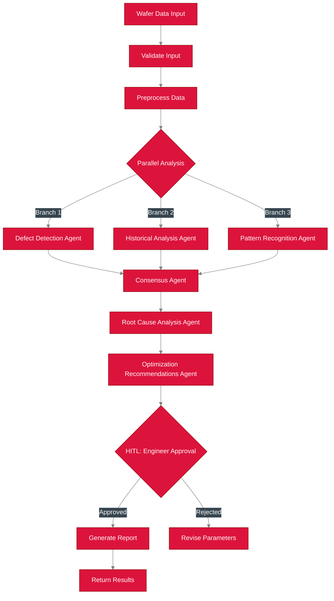
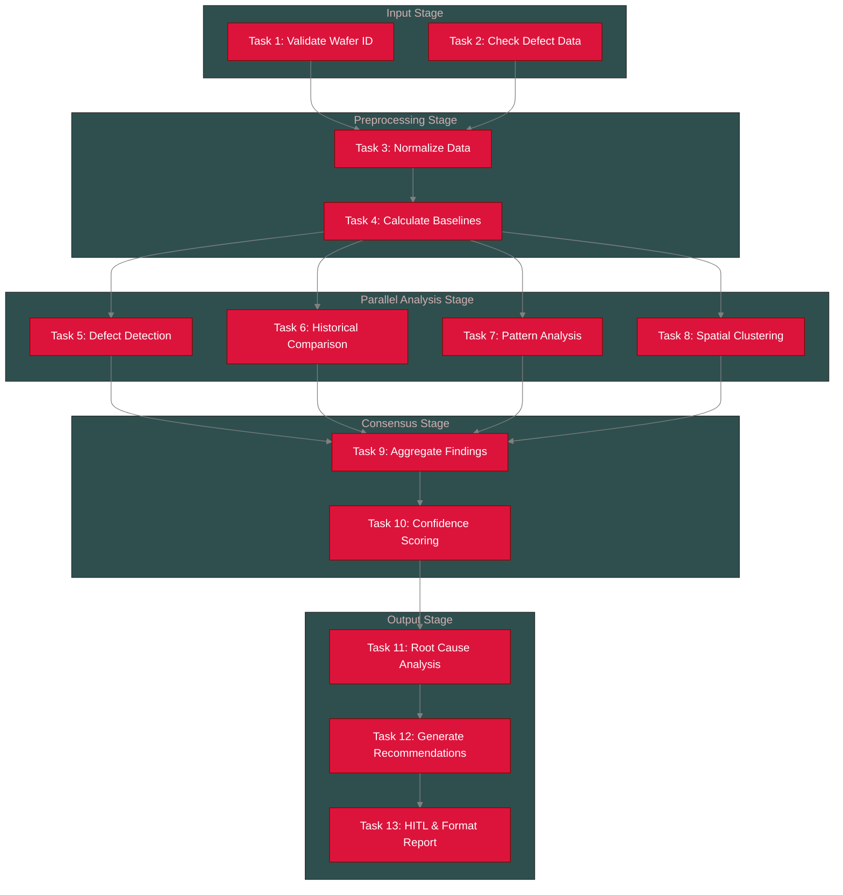
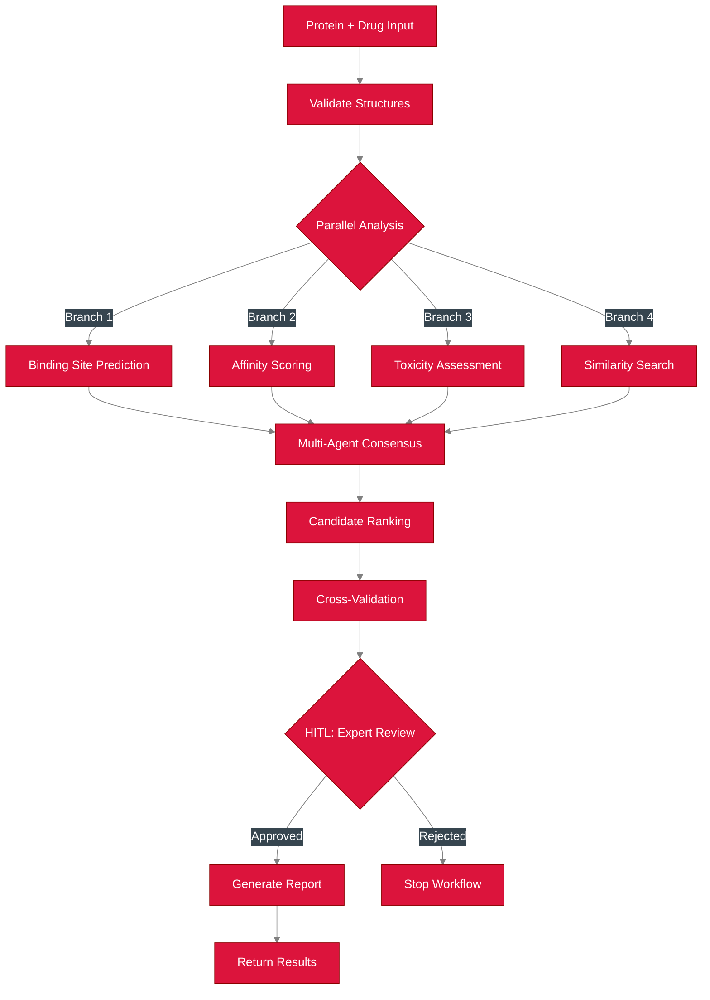
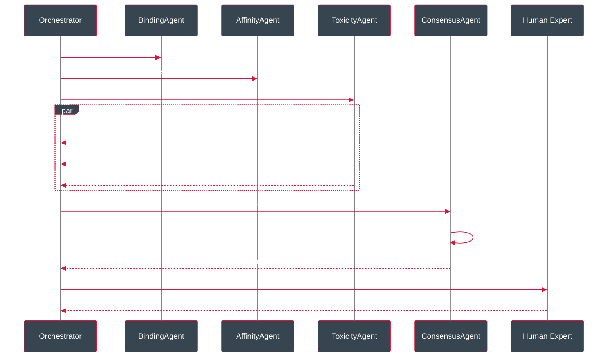

# Reference Agents & Workflows

**Nexus Ray** ships with two fully implemented reference agents that demonstrate the framework's capability to handle complex, domain-specific logic in **Life Sciences** and **Precision Manufacturing**.

These agents are not mock-ups; they are functional **7-agent workflows** that utilize the SDK, OpenVINO LLM inference, and the core orchestration engine.

---

## 1. Semiconductor Analysis Flow
This is the workflow for the Semiconductor defect analysis reference agent.

### Overview


### Detailed Task DAG


### Execution Order
The DAG scheduler determines the following execution batches:

*   **Batch 0 (Parallel)**: Task 1: Validate Wafer ID, Task 2: Check Defect Data
*   **Batch 1 (Sequential)**: Task 3: Normalize Data
*   **Batch 2 (Sequential)**: Task 4: Calculate Baselines
*   **Batch 3 (Parallel)**: Task 5: Defect Detection, Task 6: Historical Comparison, Task 7: Pattern Analysis, Task 8: Spatial Clustering
*   **Batch 4 (Sequential)**: Task 9: Aggregate Findings
*   **Batch 5 (Sequential)**: Task 10: Confidence Scoring
*   **Batch 6 (Sequential)**: Task 11: Root Cause Analysis
*   **Batch 7 (Sequential)**: Task 12: Generate Recommendations
*   **Batch 8 (HITL Node)**: Task 13: Engineer Approval & Format Report

---

## 2. Protein-Drug Discovery Flow
Workflow for the Protein-Drug interaction analysis reference agent.

### Overview


### Agent Collaboration


---

## 3. Running the Reference Agents

You can trigger these agents directly from the CLI or the Web Dashboard.

```bash
# Run Protein Discovery
python -m src.cli.run_workflow --name protein_drug_discovery

# Run Semiconductor Optimization
python -m src.cli.run_workflow --name semiconductor_yield
```
