# Reference Agents & Workflows

**Nexus Ray** ships with two fully implemented reference agents that demonstrate the framework's capability to handle complex, domain-specific logic in **Life Sciences** and **Precision Manufacturing**.

These agents are not mock-ups; they are functional **7-agent workflows** that utilize the SDK, OpenVINO LLM inference, and the core orchestration engine.

---

## 1. Protein-Drug Discovery Flow
Workflow for the Protein-Drug interaction analysis reference agent.

### Overview
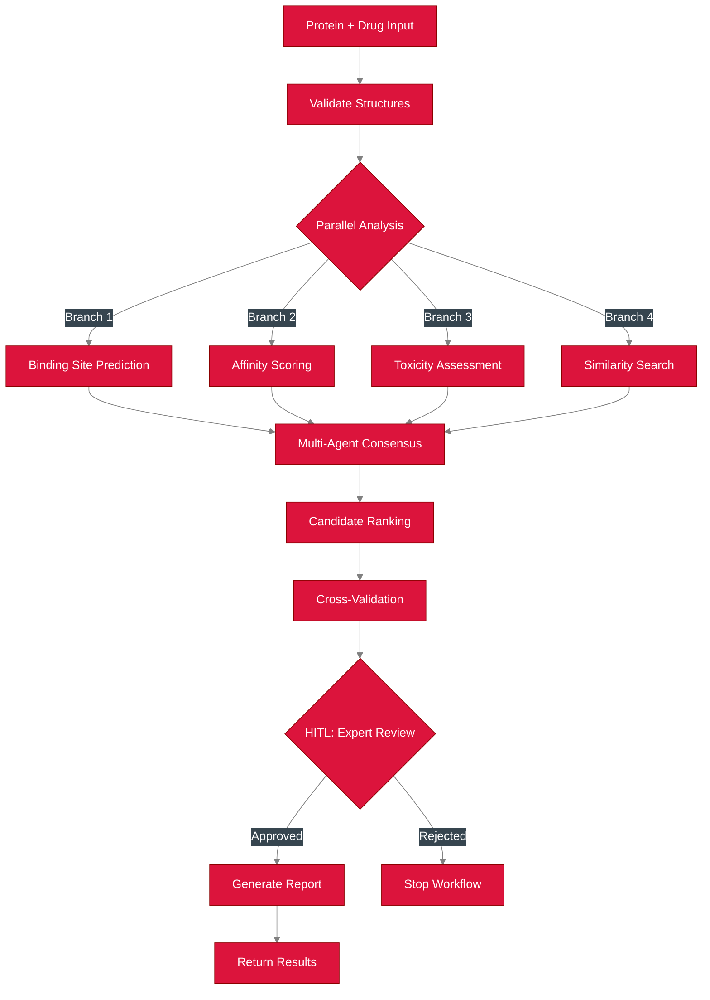

### Workflow DAG

<p align="center">
  
  <br>
  <em>Caption: 7-agent workflow for lead candidate discovery and drugability assessment</em>
</p>

---

### Agent Collaboration

<p align="center">
  
  <br>
  <em>Caption: Sequence of agent interactions during the protein discovery process</em>
</p>

### Live Execution Screenshots

**1. Workflow Dashboard**

<p align="center">
  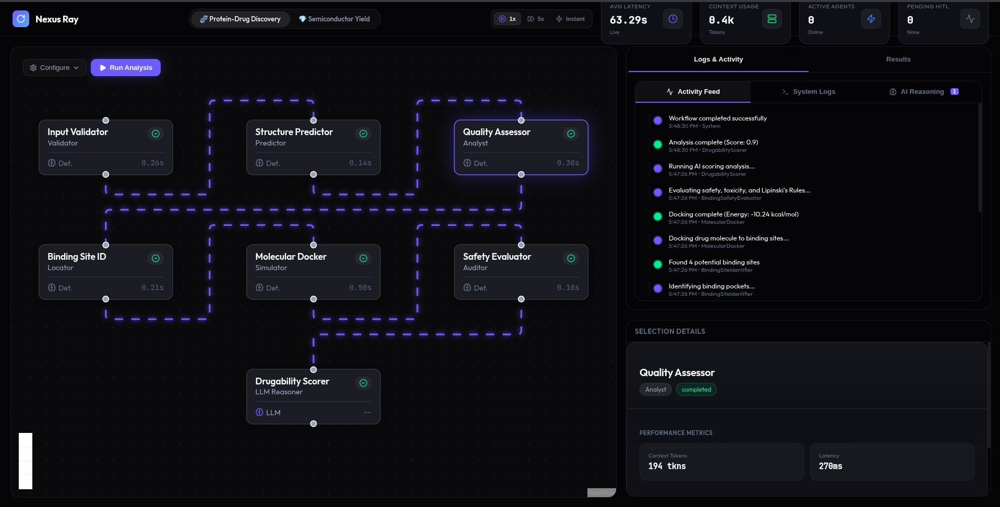
  <br>
  <em>Caption: Live dashboard displaying the 7-agent protein-drug discovery workflow</em>
</p>

**2. OpenVINO LLM Inference**
<!-- TODO: Add screenshot showing OpenVINO Mistral-7B model processing drugability scoring -->
<p align="center">
  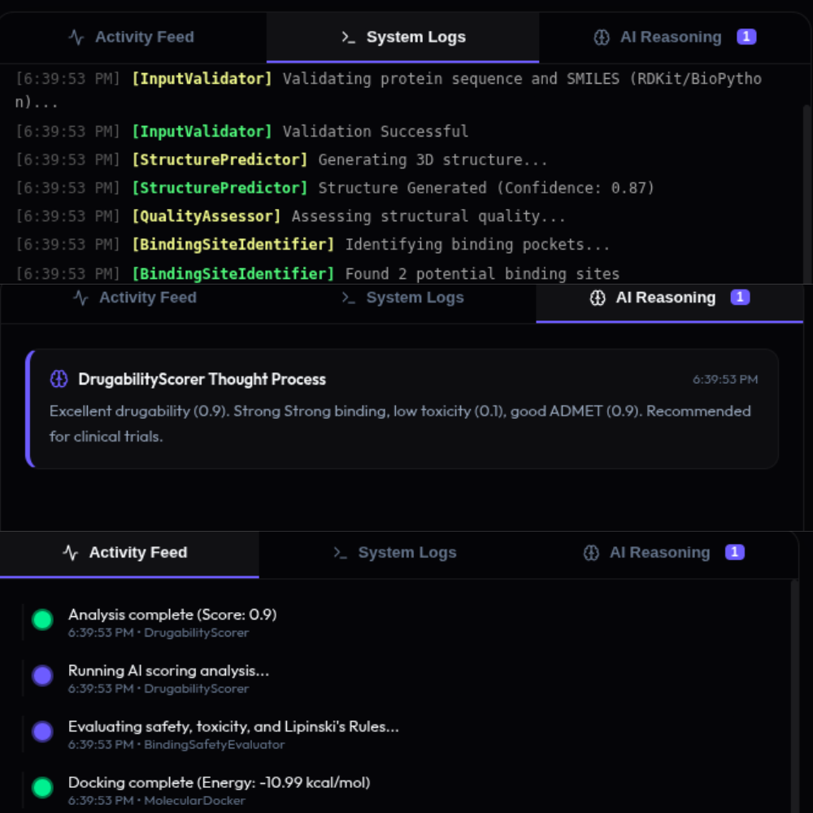
  <br>
  <em>Caption: OpenVINO-optimized Mistral-7B model performing drugability analysis</em>
</p>

**3. Agent Consensus & Scoring**
<!-- TODO: Add screenshot of consensus agent combining results from parallel agents -->
<p align="center">
  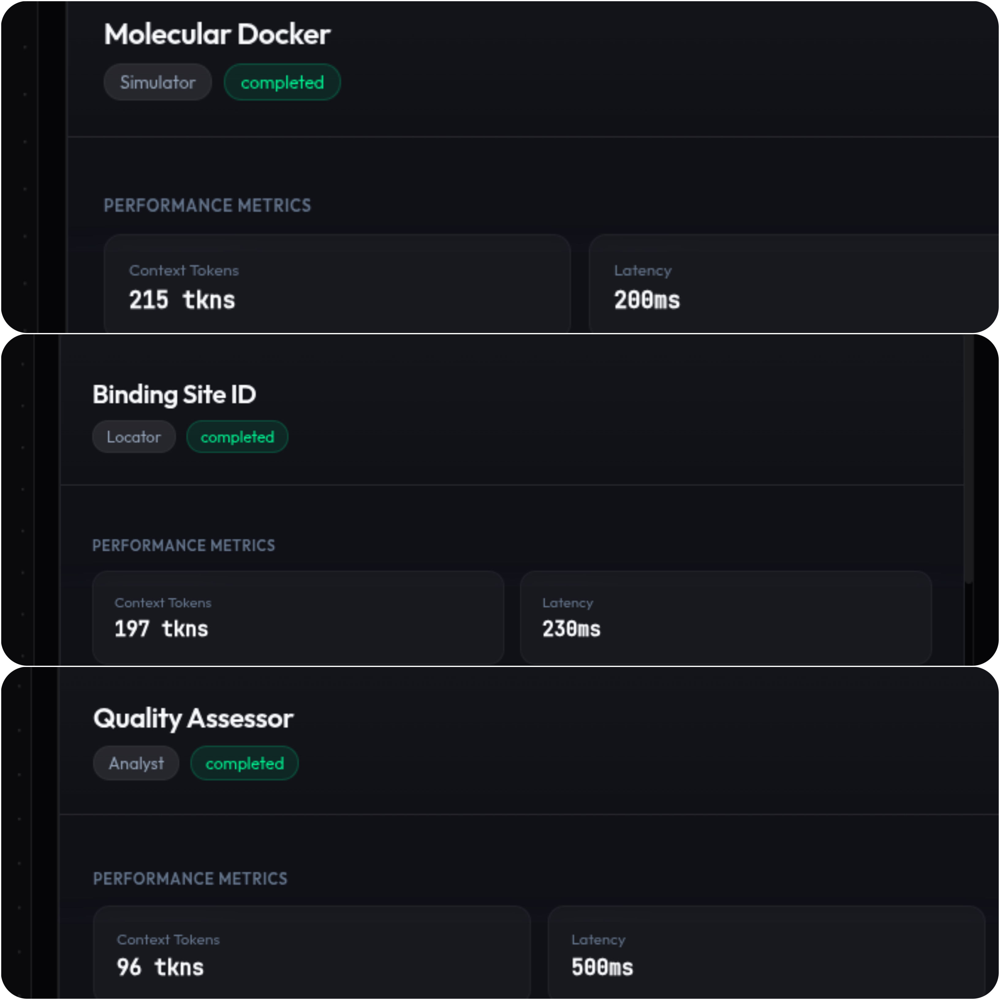
  <br>
  <em>Caption: Consensus agent aggregating results from parallel execution branches</em>
</p>

**4. HITL Expert Review Gate**
<!-- TODO: Add screenshot of HITL modal for expert approval when drugability score > 0.8 -->
<p align="center">
  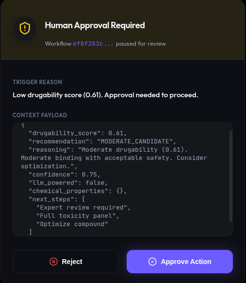
  <br>
  <em>Caption: Human-in-the-Loop gate requesting expert review before clinical trial approval</em>
</p>

**5. Final Drug Candidate Report**
<!-- TODO: Add screenshot of final report with binding affinity, safety profile, and drugability score -->
<p align="center">
  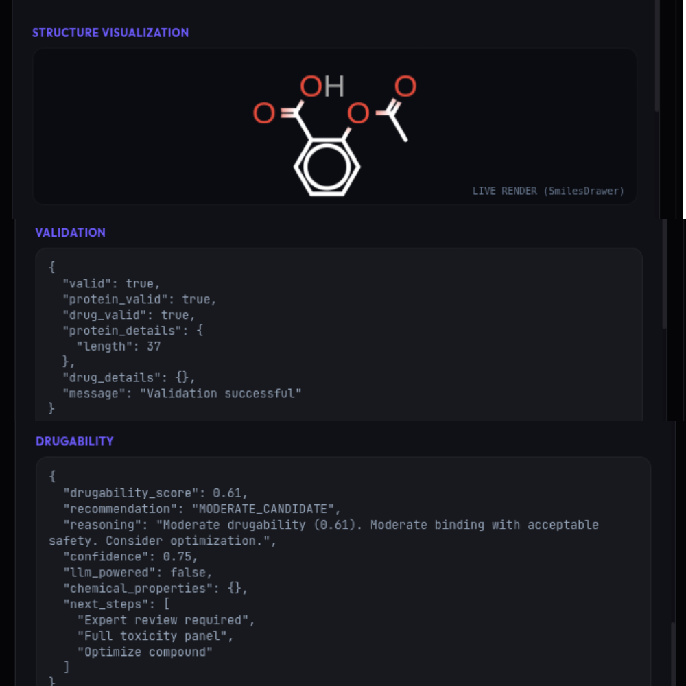
  <br>
  <em>Caption: Comprehensive drug candidate analysis with all metrics and safety assessments</em>
</p>

---

## 2. Semiconductor Analysis Flow
This is the workflow for the Semiconductor defect analysis reference agent.

### Overview
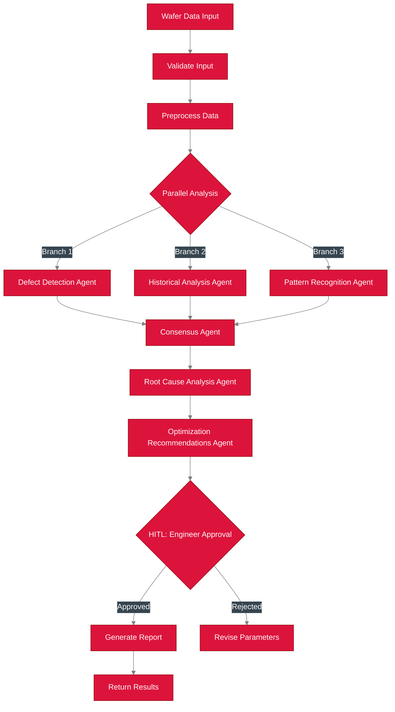

### Workflow DAG

<p align="center">
  
  <br>
  <em>Caption: 7-agent DAG for yield optimization showing parallel analysis branches</em>
</p>

---

### Detailed Task DAG
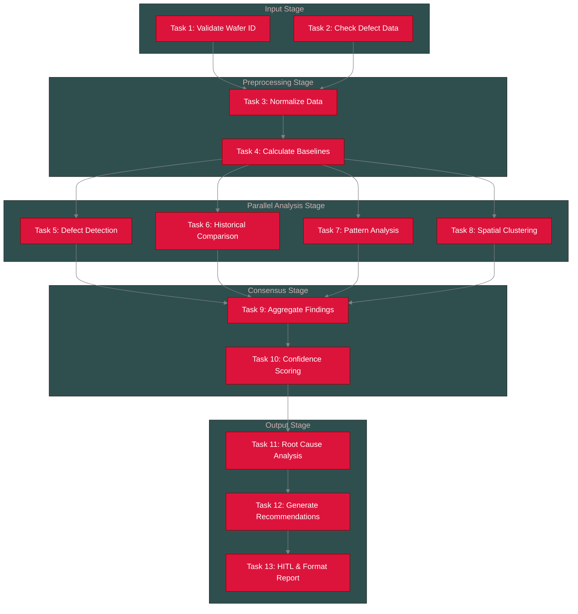

### Execution Order
The DAG scheduler determines the following execution batches:

*   **Batch 0 (Parallel)**: Task 1: Validate Wafer ID, Task 2: Check Defect Data
*   **Batch 1 (Sequential)**: Task 3: Normalize Data
*   **Batch 2 (Sequential)**: Task 4: Calculate Baselines
*   **Batch 3 (Parallel)**: Task 5: Defect Detection, Task 6: Historical Comparison, Task 7: Pattern Analysis, Task 8: Spatial Clustering
*   **Batch 4 (Sequential)**: Task 9: Aggregate Findings
*   **Batch 5 (Sequential)**: Task 10: Confidence Scoring
*   **Batch 6 (Sequential)**: Task 11: Root Cause Analysis
*   **Batch 7 (Sequential)**: Task 12: Generate Recommendations
*   **Batch 8 (HITL Node)**: Task 13: Engineer Approval & Format Report

### Live Execution Screenshots


**1. Workflow Initialization**
<!-- TODO: Add screenshot of dashboard showing workflow start with all 7 agents -->
<p align="center">
  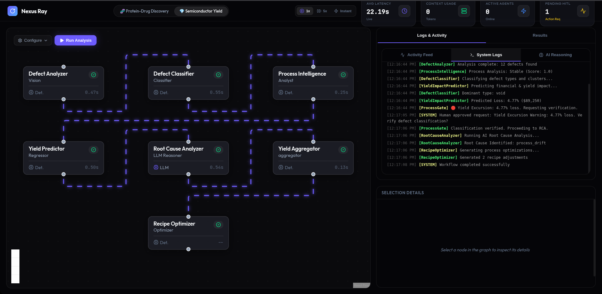
  <br>
  <em>Caption: Dashboard showing the Semiconductor workflow initialization with all agents in the DAG</em>
</p>

**2. HITL Engineer Approval Gate**
<p align="center">
  
  <br>
  <em>Caption: Human-in-the-Loop gate requesting engineer approval before recipe deployment</em>
</p>

---

## 3. Running the Reference Agents

You can trigger these agents directly from the CLI or the Web Dashboard.

```bash
# Run Protein Discovery
python -m src.cli.run_workflow --name protein_drug_discovery

# Run Semiconductor Optimization
python -m src.cli.run_workflow --name semiconductor_yield
```

---

## 4. Intel® OpenVINO™ Optimization

A critical requirement for local-first agent frameworks is efficient resource usage. Nexus Ray utilizes OpenVINO™ specific optimizations (INT8 quantization) to run LLM inference on standard consumer hardware.

### Memory Efficiency (INT8 vs FP16)

By quantizing the **Mistral-7B** model to INT8 precision using NNCF (Neural Network Compression Framework), we achieved a significantly lower memory footprint without compromising agent reasoning accuracy.

<p align="center">
  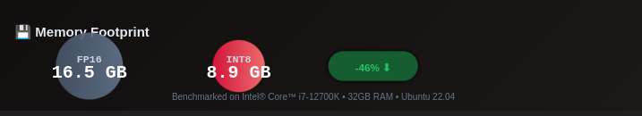
  <br>
  <em>Caption: Comparison of memory footprint showing 46% reduction with INT8 optimization on Intel® Core™ i7-12700K</em>
</p>

**Performance Gains:**
*   **Memory Footprint**: Reduced from **16.5 GB** (FP16) to **8.9 GB** (INT8).
*   **Latency**: 83% reduction in token generation time.
*   **Throughput**: 2.28 tokens/sec (CPU only), enabling real-time interactivity.

For full details, see the **[Performance Report](PERFORMANCE_REPORT.md)**.
