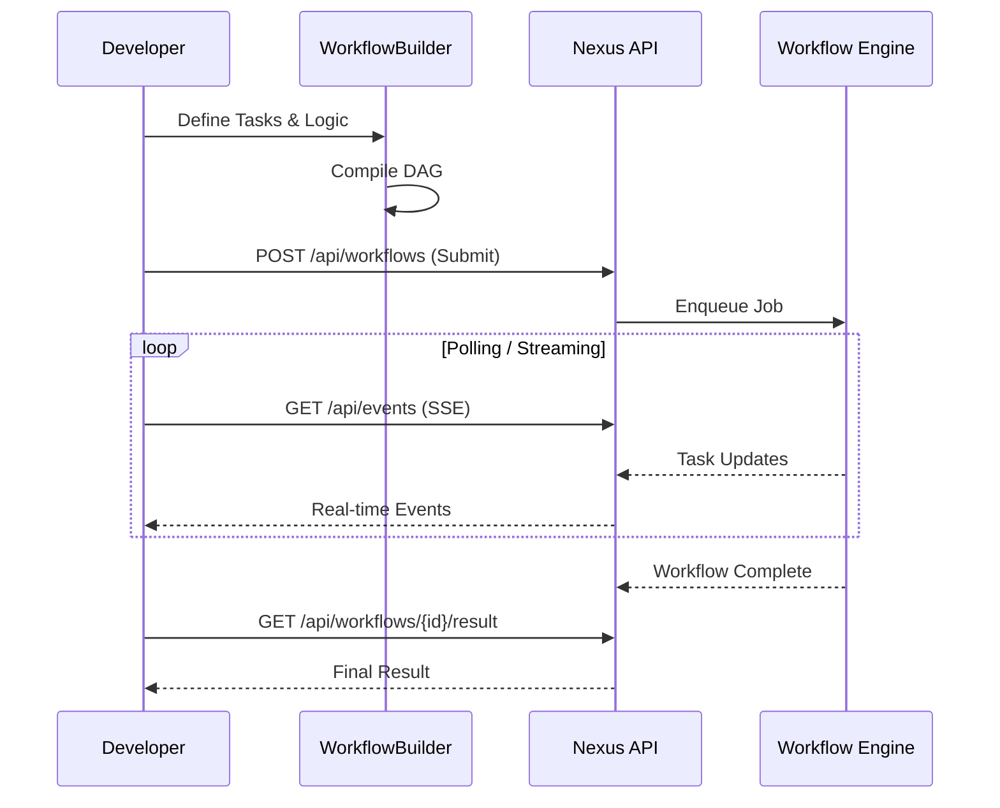

# Nexus Ray SDK & API Reference

**Version**: 1.0  
**Target Audience**: Developers building custom agents on Nexus Ray.

---

## 1. Overview

The **Nexus Ray SDK** provides a fluent, Pythonic API for defining complex, multi-agent workflows. It abstracts away the complexity of DAG management, Kafka messaging, and state persistence, allowing you to focus on agent logic.

### Workflow Lifecycle



### Quick Example

```python
from src.sdk.workflow_builder import WorkflowBuilder

# Initialize
wf = WorkflowBuilder("research_pipeline")

# Add Steps
wf.add_llm_task(
    task_id="search",
    prompt="Research standard protocols for {topic}",
    model="mistral-7b-ov"
).add_llm_task(
    task_id="summarize", 
    prompt="Summarize the following research: {parent_output}",
    depends_on=["search"]
).add_hitl_gate(
    task_id="approval",
    after="summarize",
    approvers=["lead@lab.com"]
)

# Compile
definition = wf.compile()
```

---

## 2. The `WorkflowBuilder` Class

The core entry point for creating agents.

```python
from src.sdk.workflow_builder import WorkflowBuilder

builder = WorkflowBuilder(name="my_agent_system")
```

### 2.1 Adding Tasks

The generic `add_task` method allows full control over task execution.

```python
builder.add_task(
    task_id="data_loader",
    task_type=TaskType.TOOL,
    name="Load CSV Data",
    inputs={"path": "data/sales.csv"},
    timeout_seconds=30
)
```

### 2.2 LLM Tasks (`add_llm_task`)

Specialized helper for Large Language Model inference steps, optimized for Intel® OpenVINO™.

| Parameter | Type | Description |
| :--- | :--- | :--- |
| `task_id` | `str` | Unique identifier for the step |
| `prompt` | `str` | Template string (can use `{parent_output}`) |
| `model` | `str` | Model ID (default: `"mistral-7b-ov"`) |
| `temperature` | `float` | Creativity (0.0 - 1.0) |

```python
builder.add_llm_task(
    task_id="creative_writing",
    prompt="Write a poem about {subject}",
    temperature=0.9
)
```

### 2.3 Human-in-the-Loop (`add_hitl_gate`)

Pauses execution until a human administrator approves the step via the Dashboard.

```python
builder.add_hitl_gate(
    task_id="legal_review",
    after="contract_drafting",
    approvers=["legal@company.com"],
    notification_channels=["email", "slack"]
)
```

---

## 3. Advanced Features

### 3.1 Dependencies & Parallelism

Nexus Ray automatically parallelizes tasks that do not depend on each other.

```python
# These two run in parallel
wf.add_task("analyze_image", ...)
wf.add_task("analyze_text", ...)

# This waits for BOTH to finish
wf.add_task("combine_results", ..., depends_on=["analyze_image", "analyze_text"])
```

### 3.2 Metadata & Customization

Attach metadata to workflows for tracking and auditing.

```python
wf.add_metadata("version", "1.0.5")
wf.add_metadata("department", "finance")
wf.set_timeout(3600) # 1 hour global timeout
```

### 3.3 Visualization

Debug your DAG structure before running it.

```python
print(wf.visualize())
# Output:
# Workflow: research_pipeline (wf-abc123)
#   [LLM] search
#     Depends on: none
#   [LLM] summarize
#     Depends on: search
```

---

## 4. API Reference

### REST API

Once deployed, workflows are accessible via the FastAPI backend.

*   `POST /api/workflows`: Submit a new workflow execution.
*   `GET /api/workflows/{id}/status`: Poll execution status.
*   `GET /api/events`: Server-Sent Events (SSE) stream for real-time updates.

### Executing via CLI

```bash
# Run a defined workflow
python -m src.cli.run_workflow --name protein_drug_discovery
```
