# Nexus Ray: DAG Workflow Flows

This document provides visual representations of the DAG (Directed Acyclic Graph) workflows in the Nexus Ray framework.

## Table of Contents

1. [Core DAG Architecture](#core-dag-architecture)
2. [Semiconductor Analysis Flow](#semiconductor-analysis-flow)
3. [Protein-Drug Discovery Flow](#protein-drug-discovery-flow)
4. [Generic Multi-Agent Flow](#generic-multi-agent-flow)
5. [Error Handling & Retries](#error-handling--retries)

---

## Core DAG Architecture

### High-Level System Flow

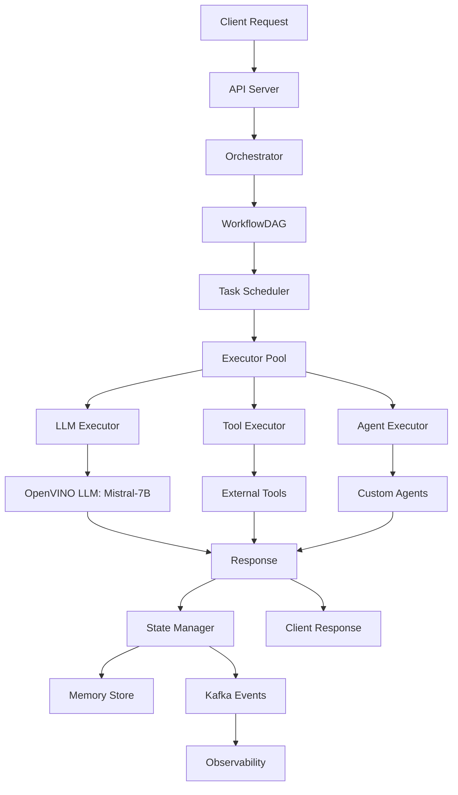

### DAG Execution Model

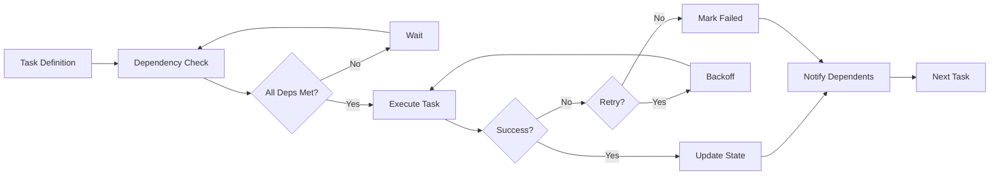

---

## Semiconductor Analysis Flow

This is the workflow for the Semiconductor defect analysis reference agent.

### Overview

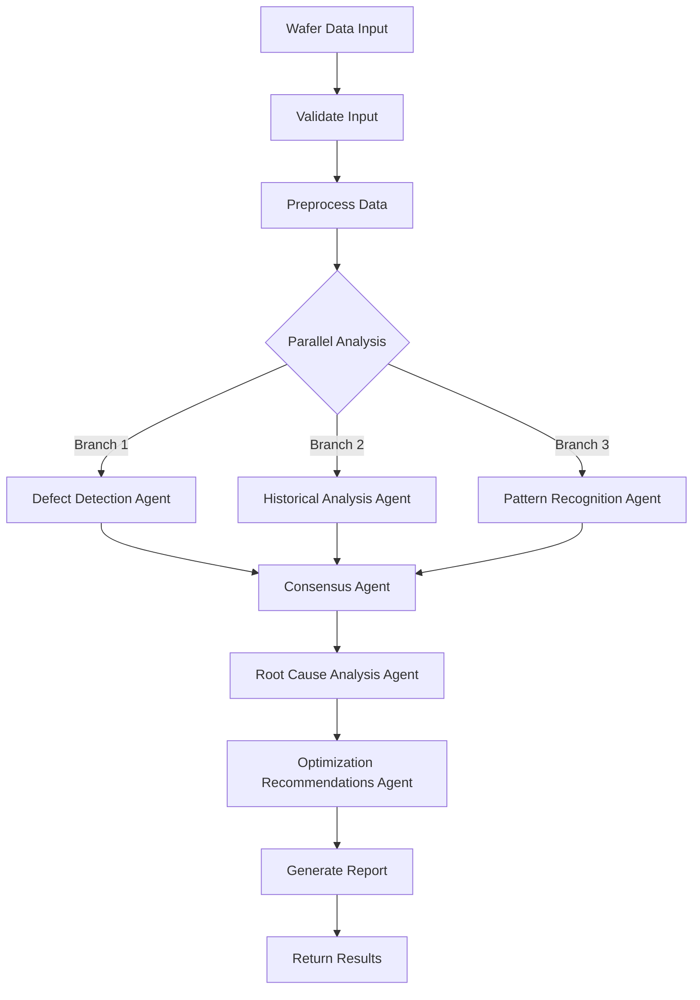

### Detailed Task DAG

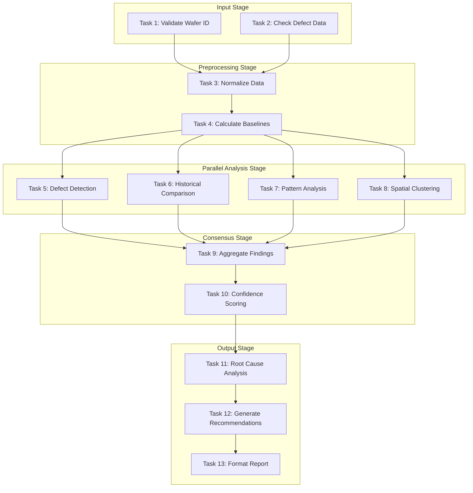

### Execution Order

The DAG scheduler determines the following execution batches:

**Batch 0 (Parallel):**
- Task 1: Validate Wafer ID
- Task 2: Check Defect Data

**Batch 1 (Sequential):**
- Task 3: Normalize Data

**Batch 2 (Sequential):**
- Task 4: Calculate Baselines

**Batch 3 (Parallel):**
- Task 5: Defect Detection
- Task 6: Historical Comparison
- Task 7: Pattern Analysis
- Task 8: Spatial Clustering

**Batch 4 (Sequential):**
- Task 9: Aggregate Findings

**Batch 5 (Sequential):**
- Task 10: Confidence Scoring

**Batch 6 (Sequential):**
- Task 11: Root Cause Analysis

**Batch 7 (Sequential):**
- Task 12: Generate Recommendations

**Batch 8 (Sequential):**
- Task 13: Format Report

---

## Protein-Drug Discovery Flow

Workflow for the Protein-Drug interaction analysis reference agent.

### Overview

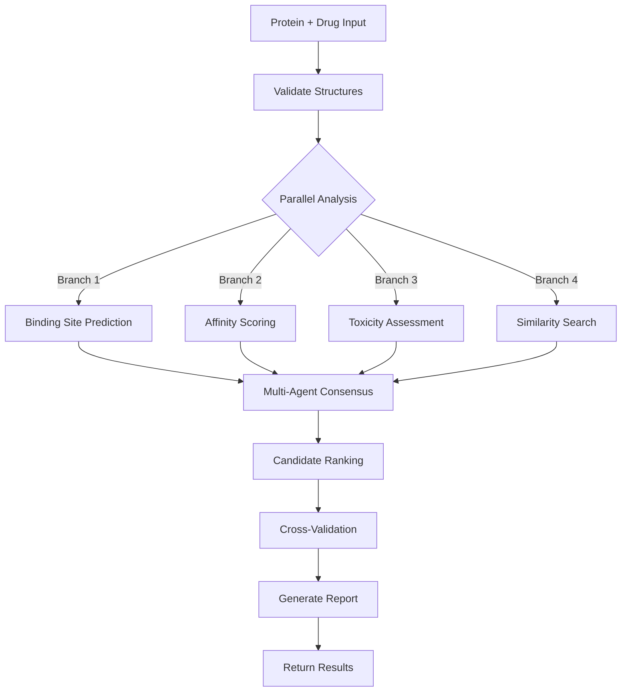

### Agent Collaboration

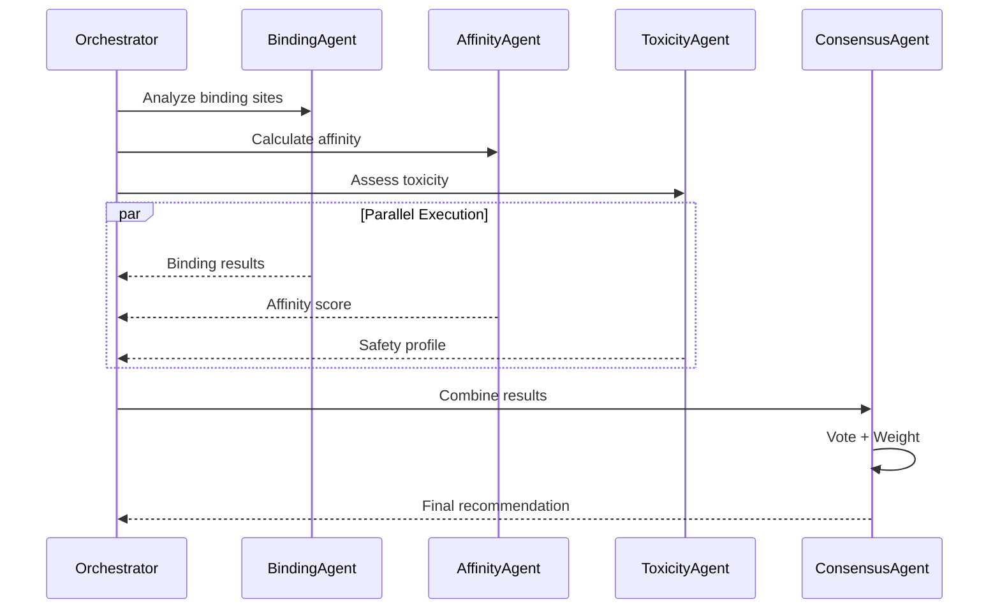

---

## Generic Multi-Agent Flow

Template for any multi-agent workflow in Nexus Ray.

### Pattern: Fork-Join with Consensus

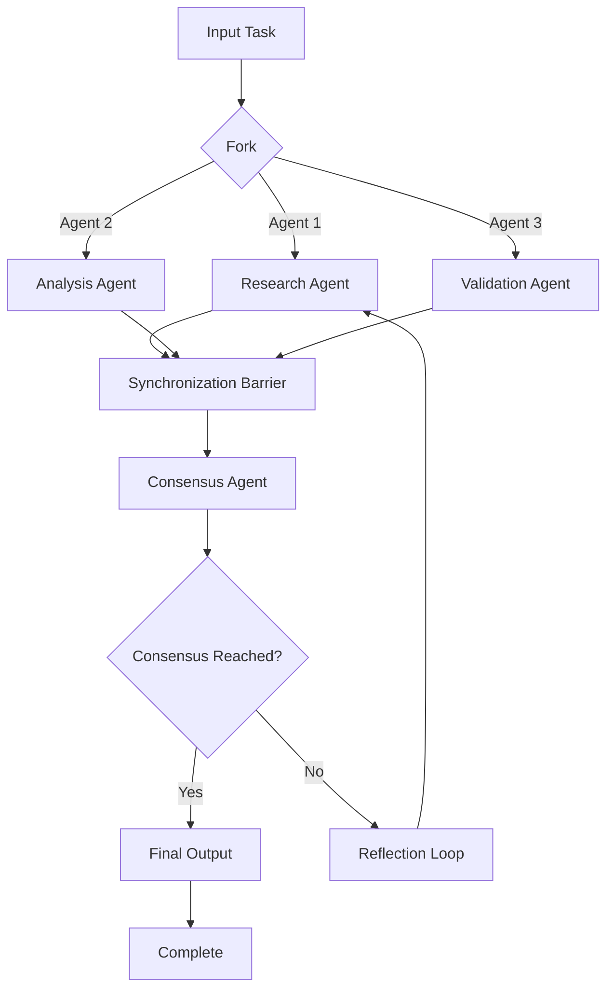

### Pattern: Sequential Pipeline

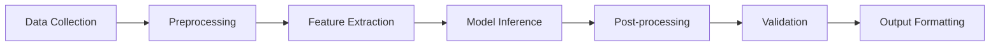

### Pattern: Iterative Refinement

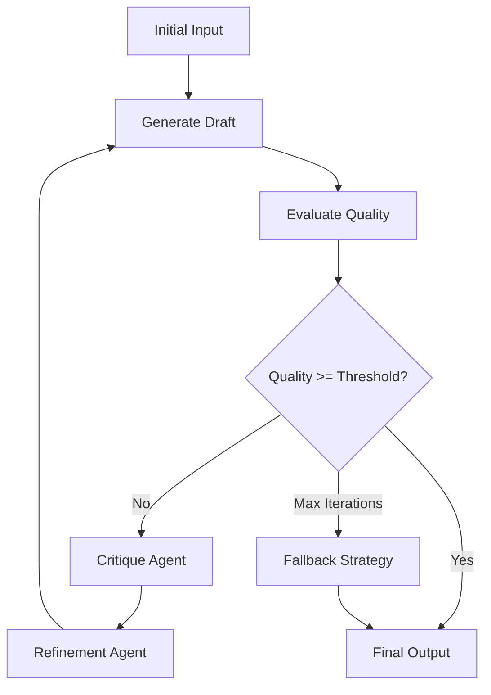

---

## Error Handling & Retries

### Retry Logic Flow

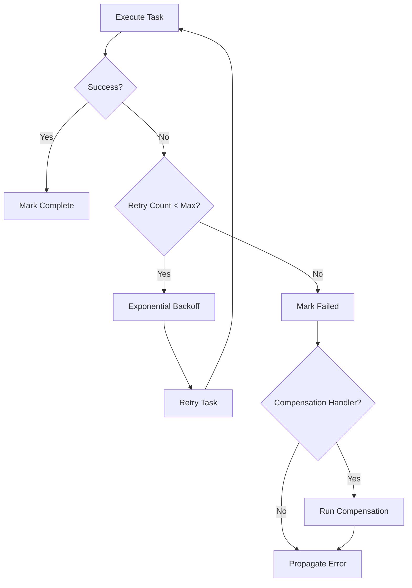

### Circuit Breaker Pattern

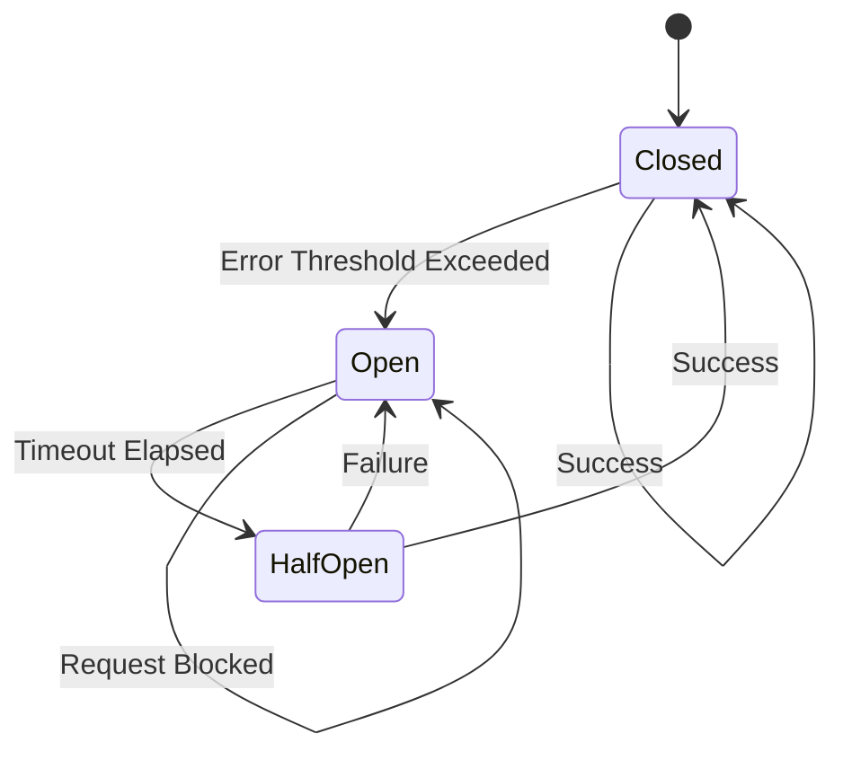

---

## Task Dependencies Visualization

### Example: Complex Workflow

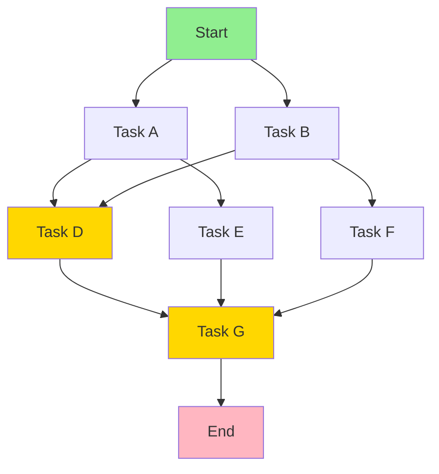

**Dependency Matrix:**

| Task | Depends On | Can Run With |
|------|-----------|--------------|
| A | Start | B |
| B | Start | A |
| D | A, B | - |
| E | A | F |
| F | B | E |
| G | D, E, F | - |
| End | G | - |

---

## Execution Monitoring

### State Transitions

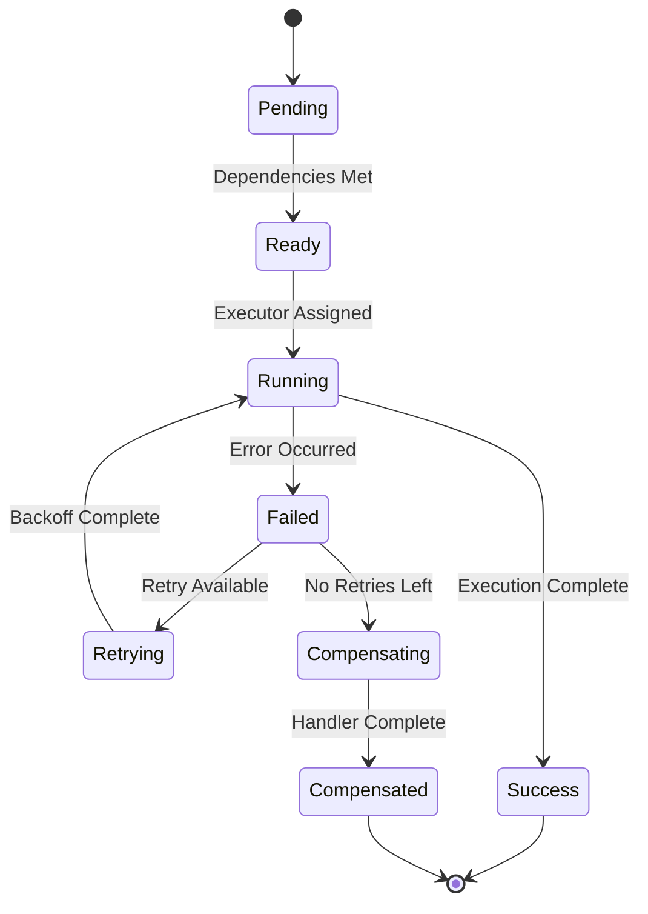

### Metrics Collection Points

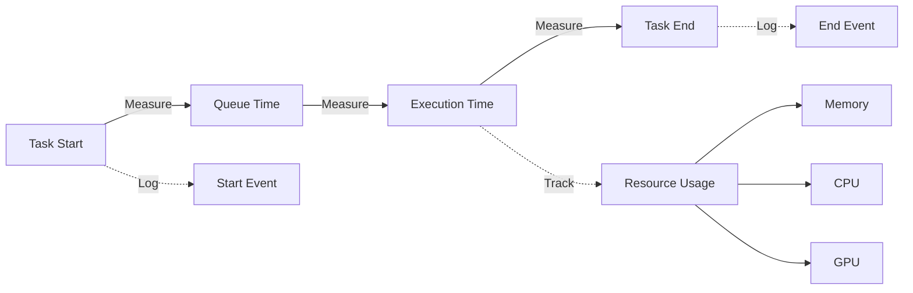

---

## Real-World Example: Semiconductor Workflow Code

### Building the DAG

```python
from src.core.dag import WorkflowDAG
from src.core.task import TaskDefinition

# Create DAG
workflow = WorkflowDAG(workflow_id="semiconductor-analysis-001")

# Define tasks
validate_task = TaskDefinition(
    task_id="validate",
    name="Validate Input",
    task_type="validation",
    depends_on=[]
)

preprocess_task = TaskDefinition(
    task_id="preprocess",
    name="Preprocess Data",
    task_type="preprocessing",
    depends_on=["validate"]
)

defect_task = TaskDefinition(
    task_id="defect",
    name="Defect Detection",
    task_type="agent",
    depends_on=["preprocess"]
)

historic_task = TaskDefinition(
    task_id="historic",
    name="Historical Analysis",
    task_type="agent",
    depends_on=["preprocess"]
)

consensus_task = TaskDefinition(
    task_id="consensus",
    name="Consensus",
    task_type="agent",
    depends_on=["defect", "historic"]
)

# Add to DAG
workflow.add_task(validate_task)
workflow.add_task(preprocess_task)
workflow.add_task(defect_task)
workflow.add_task(historic_task)
workflow.add_task(consensus_task)

# Add dependencies
workflow.add_dependency("validate", "preprocess")
workflow.add_dependency("preprocess", "defect")
workflow.add_dependency("preprocess", "historic")
workflow.add_dependency("defect", "consensus")
workflow.add_dependency("historic", "consensus")

# Validate
workflow.validate()

# Get execution order
batches = workflow.get_execution_order()
# Output: [['validate'], ['preprocess'], ['defect', 'historic'], ['consensus']]
```

### Executing the Workflow

```python
from src.core.orchestrator import Orchestrator

orchestrator = Orchestrator()

# Execute workflow
result = await orchestrator.execute_workflow(
    workflow=workflow,
    initial_context={"wafer_id": "WAF-9982-X"}
)

print(f"Status: {result.status}")
print(f"Output: {result.output}")
```

---

## Best Practices

### 1. Task Granularity

✅ **Good:** Fine-grained tasks
```python
- Validate input
- Load model
- Run inference
- Post-process
```

❌ **Bad:** Coarse-grained tasks
```python
- Do everything
```

### 2. Dependency Management

✅ **Good:** Explicit dependencies
```python
task.depends_on = ["task_a", "task_b"]
```

❌ **Bad:** Implicit ordering
```python
# Relying on execution order without declaring deps
```

### 3. Error Handling

✅ **Good:** Graceful degradation
```python
task.retry_config = RetryConfig(
    max_retries=3,
    backoff_base=2.0
)
task.fallback_handler = fallback_fn
```

❌ **Bad:** Fail entire workflow
```python
# No retry or fallback
```

---

## Performance Optimization

### Maximizing Parallelism

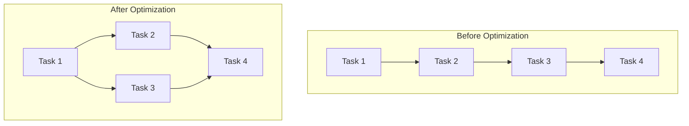

### Resource Allocation

```python
# Assign resource requirements
task.resource_requirements = {
    "cpu": 2,
    "memory_gb": 4,
    "gpu": 0
}

# Executor pool will schedule accordingly
```

---

## Debugging DAG Workflows

### Visualization Tools

```bash
# Generate ASCII visualization
python -c "
from src.core.dag import WorkflowDAG
dag = WorkflowDAG.from_file('workflow.json')
print(dag.visualize_ascii())
"
```

### Execution Trace

```python
# Enable detailed logging
workflow.execution_config.log_level = "DEBUG"

# This will log:
# - Task start/end times
# - Dependency resolution
# - Parallel batch execution
# - State transitions
```

---

## References

- [Core DAG Implementation](../src/core/dag.py)
- [Orchestrator](../src/core/orchestrator.py)
- [Task Definitions](../src/core/task.py)
- [Semiconductor Reference Agent](../reference_agents/semiconductor/)
- [Protein-Drug Reference Agent](../reference_agents/protein_drug/)

## Next Steps

- **[Try Examples](../examples/)** - Run pre-built workflows
